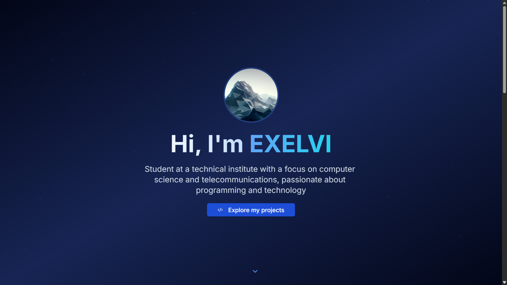
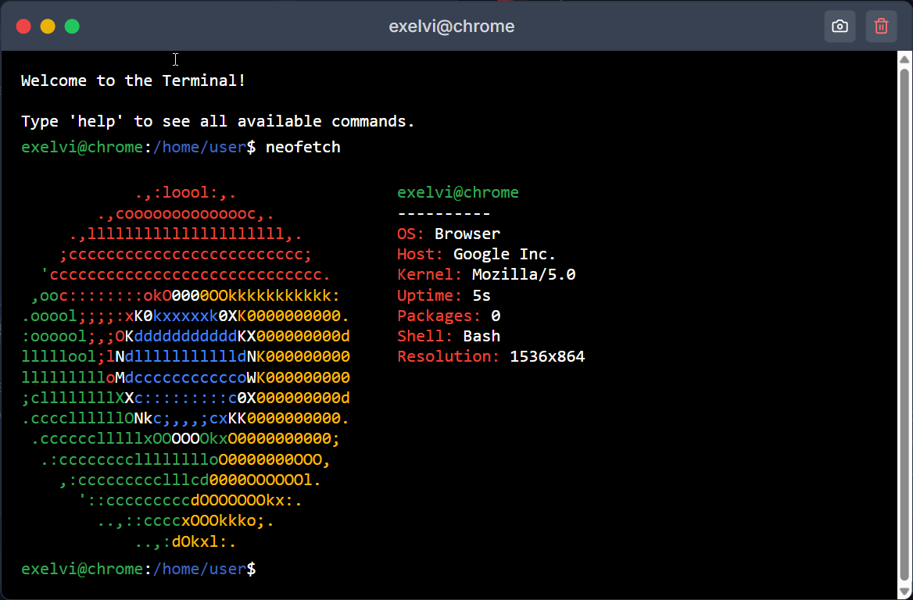

# 🖥️ EXELVI Portfolio - Home Page & Terminal



[](https://reactjs.org/)
[](https://www.typescriptlang.org/) 
[](https://tailwindcss.com/)
[](https://ui.shadcn.com/)

> 🚀 Modern portfolio with fully functional web terminal

[](https://exelvi.xyz)  

## 📖 Overview

This project features a modern personal portfolio developed with **React**, featuring a home page with an integrated **interactive web terminal** with complete virtual file system.

---

## 🏠 Home Page Features

### 🎨 **Main Sections**

| Section             | Features                                                       |
| ------------------- | -------------------------------------------------------------- |
| 🌟 **Hero Section** | Particle animations, blur text effects, dynamic gradients     |
| 📂 **Projects**     | Gallery, integrated terminal modal                             |
| 👤 **About Me**     | Informative cards, skill badges                               |
| 📱 **Social Links** | Icons                                                          |

### ✨ **Advanced Features**

- 🌐 **Multi-language System** (IT/EN) with automatic browser detection
- 🎭 **Smooth Animations**
- 🎨 **Modern UI/UX** with Shadcn/ui components

---

## 💻 Web Terminal

 

> [!NOTE]\
> __How to open the terminal?__ Go to the Projects section and on the **Terminal** project click on **Try** button.

### 🔧 **Technical Features**

- 🖱️ **Draggable Window** with complete controls (minimize/maximize/close)
- 💾 **Virtual File System** persistent with localStorage
- 📸 **Integrated Screenshot** with html2canvas 

---

## 🛠️ Available Terminal Commands

### 📁 **File System**

| Command           | Description               | Usage Examples                  |
| ----------------- | ------------------------- | ------------------------------- |
| `ls [-la]`        | List files and directories| `ls -la`, `ls /home`            |
| `cd [path]`       | Change directory          | `cd /home/user`, `cd ..`        |
| `pwd`             | Show current directory    | `pwd`                           |
| `mkdir [dir]`     | Create directory          | `mkdir documents`               |
| `touch [file]`    | Create empty file         | `touch test.txt`                |
| `rm [-rf] [file]` | Delete file/directory     | `rm file.txt`, `rm -rf folder/` |
| `mv [src] [dest]` | Move/rename               | `mv old.txt new.txt`            |
| `cp [src] [dest]` | Copy file                 | `cp file.txt backup.txt`        |
| `cat [file]`      | Display content           | `cat document.txt`              |
| `nano [file]`     | Text editor               | `nano script.sh`                |

### 🔍 **Search and Filters**

| Command                       | Description        | Usage Examples         |
| ----------------------------- | ------------------ | ---------------------- |
| `find [path] -name [pattern]` | Search files       | `find / -name "*.txt"` |
| `tree [path]`                 | Tree view          | `tree /home`           |
| `head [-n] [file]`            | First lines        | `head -10 log.txt`     |
| `tail [-n] [file]`            | Last lines         | `tail -20 access.log`  |
| `wc [-lwc] [file]`            | Count lines/words  | `wc -l document.txt`   |
| `sort [-rnu] [file]`          | Sort content       | `sort names.txt`       |

### 🗜️ **Archives and Compression**

| Command                      | Description         | Usage Examples              |
| ---------------------------- | ------------------- | --------------------------- |
| `tar -cvf [archive] [files]` | Create tar archive  | `tar -cvf backup.tar docs/` |
| `tar -xvf [archive]`         | Extract tar archive | `tar -xvf backup.tar`       |
| `zip [-r] [archive] [files]` | Create zip archive  | `zip -r project.zip src/`   |
| `unzip [-l] [archive]`       | Extract/list zip    | `unzip project.zip`         |

### 👥 **System and Users**

| Command          | Description      | Usage Examples          |
| ---------------- | ---------------- | ----------------------- |
| `whoami`         | Current user     | `whoami`                |
| `su [user]`      | Switch user      | `su root`, `su john`    |
| `sudo [command]` | Execute as root  | `sudo rm system.log`    |
| `passwd [user]`  | Change password  | `passwd`, `passwd john` |

### 🔧 **Utilities and System**

| Command              | Description          | Usage Examples       |
| -------------------- | -------------------- | -------------------- |
| `echo [text]`        | Print text           | `echo "Hello World"` |
| `date`               | Current date and time| `date`               |
| `clear`              | Clear terminal       | `clear`              |
| `history`            | Command history      | `history`            |
| `help`               | Command list         | `help`               |
| `neofetch`           | System information   | `neofetch`           |
| `stats [-c\|-s\|-e]` | Usage statistics     | `stats -c`           |

### 🎨 **Customization**

| Command                    | Description   | Usage Examples      |
| -------------------------- | ------------- | ------------------- |
| `alias [name]='[command]'` | Create alias  | `alias ll='ls -la'` |
| `unalias [name]`           | Remove alias  | `unalias ll`        |

### 📸 **Advanced Utilities**

| Command        | Description           | Usage Examples |
| -------------- | --------------------- | -------------- |
| `screenshot`   | Terminal screenshot   | `screenshot`   |
| `export-state` | Export state          | `export-state` |
| `load-state`   | Load state            | `load-state`   |
| `save-state`   | Save manually         | `save-state`   |
| `storage-info` | localStorage info     | `storage-info` |

### 🐛 **Debug and Development**

| Command                         | Description   | Usage Examples|
| ------------------------------- | ------------- | ------------- |
| `debug [fs\|settings\|history]` | System debug  | `debug fs`    |

---

## 🚀 **Advanced Terminal Features**

### 💡 **Smart Auto-completion**

- ✅ Command completion with **TAB**
- ✅ File and directory suggestions
- ✅ Navigate suggestions with **arrows**
- ✅ Contextual parameter preview

### 📝 **Integrated Nano Editor**

### 💾 **Data Persistence**

- ✅ Auto-save state to localStorage
- ✅ JSON configuration export/import
- ✅ Session restore after restart

---

## 🛠️ Technologies Used

### **Styling & UI**

| Technology                                                                                                         | Usage                 |
| ------------------------------------------------------------------------------------------------------------------ | --------------------- |
|  | Responsive styling    |
|           | Modern UI components  |

### **Special Features**

| Library                              | Usage                            |
| ------------------------------------ | -------------------------------- |
| **react-rnd**                        | Draggable/resizable windows      |
| **html2canvas**                      | Terminal screenshots             |
| **pako**                             | Deflate compression for archives |
| **lucide-react** and **react-icons** | Modern iconography               |

---

## 🔧 **Setup & Installation**

### **Installation**

> [!WARNING]\
> Follow the [official Next.js guide](https://nextjs.org/docs/app/getting-started/installation) before starting.

```bash
# Clone the repository
git clone https://github.com/EXELVI/website.git

# Enter the directory
cd website

# Install dependencies
pnpm install
# or
npm install

# Start in development mode
pnpm run dev
# or
npm run dev
```

### **Production Build**

```bash
# Optimized build
pnpm run build

# Start production server
pnpm run start
```
 
---

## Contributing 🤝

Contributions are always welcome! Open an issue or submit a pull request to help. Thanks!

---

Made with ❤️ by [EXELVI](https://github.com/EXELVI)
